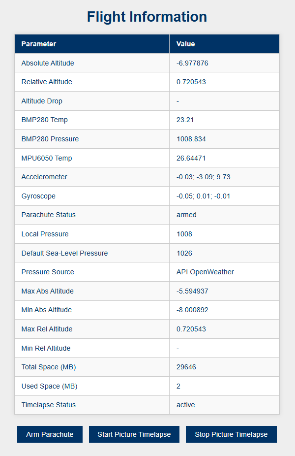

# ESP Controlled Rocket

The ESP Controlled Rocket repository is a comprehensive project that brings together an advanced flight computer system along with detailed 3D printing designs to build and launch a rocket. The project includes embedded firmware for real-time telemetry, sensor integration, parachute deployment, and a complete set of 3D models for printing the rocket parts.

---

## Table of Contents

- [Introduction](#introduction)
- [Flight Computer](#flight-computer)
  - [Features](#features)
  - [Code Overview](#code-overview)
  - [Flight Computer Screenshot](#flight-computer-screenshot)
- [3D Designs](#3d-designs)
  - [Overview of 3D Models](#overview-of-3d-models)
- [Assembly & Build](#assembly--build)
- [Usage](#usage)
- [Contributing](#contributing)

---

## Introduction

The **ESP Controlled Rocket** project combines state-of-the-art embedded firmware with ready-to-print 3D designs to create a complete rocket system. The flight computer manages sensor data, logs flight events, and controls the parachute deployment mechanism while also now featuring camera integration for real-time image capture and timelapse functionality.

---

## Flight Computer

### Features

- **Sensor Integration:**  
  - **BMP280 Sensor:** Reads temperature, pressure, and computes altitude.
  - **MPU6050 Sensor:** Provides accelerometer, gyroscope data, and sensor temperature.
- **Real-Time Telemetry:**  
  - A web server with WebSocket support streams live flight data including altitude, temperature, and inertial measurements.
- **Parachute Deployment:**  
  - Monitors altitude drop to trigger the servo-controlled parachute release.
- **Enhanced SD Card Logging:**  
  - Logs flight data, captured images, and detailed debug information.
- **Camera Integration & Timelapse Imaging:**  
  - Supports high-resolution image capture via an integrated camera module.
  - Offers timelapse mode to capture images at regular intervals.
- **Debug & Serial Output:**  
  - Improved debug options allow for granular monitoring of sensor data, camera operations, and timelapse events.
- **WiFi Connectivity & OTA Updates:**  
  - Automatically connects to a predefined network or sets up an access point.
  - Supports remote firmware updates through an HTTP OTA endpoint.
- **Time Synchronization:**  
  - Uses NTP to provide accurate timestamps for logging.

### Code Overview

The flight computer firmware is organized into modules that handle sensor management, camera initialization, data processing, SD card logging, web communication, and OTA updates. New functions include `cameraSetup()`, `captureAndSavePicture()`, and timelapse controls integrated into both the firmware and the web interface.

### Flight Computer Screenshot

---

## 3D Designs

The repository includes 3D printing designs for the rocket's structure and components. The models are optimized for easy printing and assembly.

### Overview of 3D Models

- **Rocket Body:**  
  Main structure with compartments for the electronics, payload, and fuel system.
- **Nose Cone & Fins:**  
  Aerodynamic designs to ensure optimal flight performance.
- **Assembly Parts:**  
  Custom brackets and mounting fixtures to integrate the flight computer and sensors securely.

Detailed 3D model files (.STL) and assembly instructions can be found in the [3d_designs](3d_designs) folder.

---

## Assembly & Build

For detailed build instructions, refer to the [Assembly Guide](docs/assembly_guide.md). The guide covers component assembly, wiring, and final system integration including the new camera and timelapse wiring.

---

## Usage

### Setting Up the Flight Computer

1. **WiFi Configuration:**  
   Update the network credentials in the firmware:
   const char* ssid = "TDGC-Rocket";
   const char* wifiPassword = "Rocket2022!";

If the connection fails, the device will switch to access point mode.

2. **OTA Updates**
Access the OTA update page by navigating to [http://esp32-webupdate.local/update](http://esp32-webupdate.local/update) once the device is connected to WiFi.

3. **Running the Code**
Compile and upload the code to your ESP32 using the Arduino IDE or PlatformIO.

## Debugging and Logging Variables
The firmware includes several variables that control debugging output and logging behavior. These variables can be adjusted to fine-tune what information is output to the serial console or logged to the SD card:

- **enableSensorSerialLog (default: true):**  
  Master toggle for sensor serial logging. When enabled, sensor readings and key events are printed to the serial monitor for debugging purposes.

- **logBMP280Data (default: false):**  
  Controls whether data from the BMP280 sensor (temperature, pressure, altitude) is logged to the serial output.

- **logMPU6050Data (default: false):**  
  Controls whether data from the MPU6050 sensor (accelerometer, gyroscope, temperature) is logged to the serial output.

- **logSpaceUsage (default: true):**  
  Toggles logging of SD card space usage information, showing total and used space values.

- **showCameraOutput (default: true):**  
  Enables debug messages related to camera initialization and picture capture events. If disabled, camera-related messages will not appear in the serial output.

- **showTimelapseOutput (default: true):**  
  Enables debug messages for timelapse operations, including start, stop, and image capture notifications.

- **showSensorInitLog (default: true):**  
  Controls whether sensor initialization (detection and configuration) messages are printed to the serial monitor.

- **cameraEnabled (default: true):**  
  Determines if the camera functionality is active. Setting this to false will skip camera initialization and image capture routines.

- **timelapseActive (default: false at startup):**  
  Indicates whether timelapse image capture is currently active. This is controlled through the web interface using start/stop commands.

Adjust these variables in your firmware code to increase or decrease the verbosity of debug messages and control which modules are active during your tests.

## Monitoring Flight Data
- Access the live telemetry dashboard via any web browser.
- The dashboard displays real-time flight data, including altitude, temperature, inertial measurements, camera status, and timelapse mode state.
- Use the provided buttons to arm the parachute and start/stop timelapse image capture.

## Contributing
Contributions are welcome! Please follow these guidelines:
- Fork the repository.
- Create a new branch for your feature or bugfix.
- Commit your changes with clear messages.
- Submit a pull request with a detailed description of your changes.
