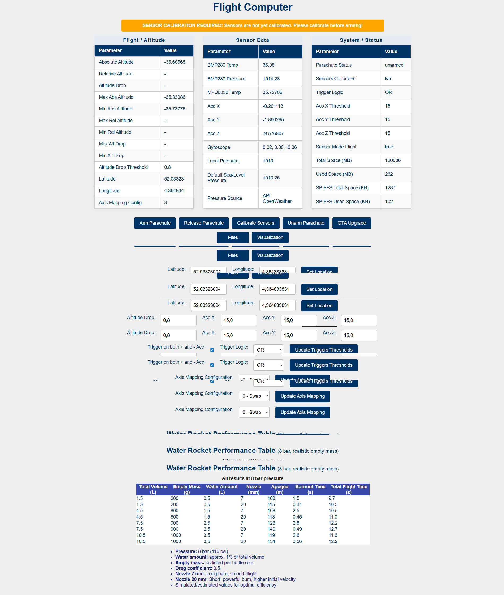

# ESP Controlled Rocket

The ESP Controlled Rocket repository documents an advanced, ESP32-powered flight computer and 3D-printed rocket design. The project provides open-source firmware, electronics, and mechanical files to launch, track, and safely recover water rockets made from plastic bottles—ranging from simple mechanically-triggered parachute releases to full telemetry-enabled, software-controlled deployments.

---

## Table of Contents
- [ESP Controlled Rocket](#esp-controlled-rocket)
  - [Table of Contents](#table-of-contents)
  - [Introduction](#introduction)
  - [Rocket Variants](#rocket-variants)
    - [Rocket A](#rocket-a)
    - [Rocket B](#rocket-b)
  -  [Splicing Bottles](https://zerneo85.github.io/ESP-Controlled-Rocket/Water-Rocket-Splice-Bilingual.html)
- [ESP Controlled Rocket](#esp-controlled-rocket-1)
  - [Flight Computer](#flight-computer)
    - [Features](#features)
    - [LED Status Indicators](#led-status-indicators)
    - [Code Overview](#code-overview)
    - [Screenshots](#screenshots)
      - [Dashboard, File Manager, and Visualization](#dashboard-file-manager-and-visualization)
  - [3D Parts \& Downloads](#3d-parts--downloads)
    - [Parts Overview (Summary)](#parts-overview-summary)
  - [Assembly \& Build](#assembly--build)
  - [Usage](#usage)
    - [Setting Up the Flight Computer](#setting-up-the-flight-computer)
    - [Setting Triggers](#setting-triggers)
    - [SPIFFS Logging](#spiffs-logging)
  - [Rocket Performance (Simulation Results)](#rocket-performance-simulation-results)
    - [Water Rocket Performance Table (8 bar, realistic empty mass)](#water-rocket-performance-table-8-bar-realistic-empty-mass)
      - [Assumptions/Notes:](#assumptionsnotes)
  - [References \& Further Simulation](#references--further-simulation)
  - [Rocket Weight](#rocket-weight)
  - [Release Notes](#release-notes)
    - [v3.7.0](#v370)
  - [Contributing](#contributing)

---

## Introduction

The **ESP Controlled Rocket** project combines embedded firmware and printable parts for building water rockets with real-time telemetry, logging, and parachute deployment.  
There are two rocket builds:

- **Rocket A:** 1 bottle, mechanical parachute release (no electronics)
- **Rocket B:** 3 × 1.5L bottles, ESP32-based telemetry, automatic parachute deployment, and advanced data logging.

---

## Rocket Variants

### Rocket A

- Single PET bottle
- Mechanical parachute release
- See [docs/aircommandrockets_simulator_rocket_a.pdf](docs/aircommandrockets_simulator_rocket_a.pdf) for simulation results

### Rocket B

- Three 1.5-liter PET bottles
- ESP32 flight computer with:
  - Telemetry (altitude, acceleration, orientation, etc.)
  - Web dashboard (WiFi)
  - Automatic and manual parachute deployment
  - Data logging (SD card + SPIFFS)
  - RGB LED status ring
  - **Automatic location/pressure/height fetching from OpenWeather API**
  - **Location and reference pressure/height can be updated on-the-fly from the web dashboard**
- See [docs/aircommandrockets_simulator_rocket_b.pdf](docs/aircommandrockets_simulator_rocket_b.pdf) for simulation results

---

# ESP Controlled Rocket

...

## Flight Computer

### Features

- **Sensor Integration:**  
  - BMP280 (temperature, pressure, altitude)
  - MPU6050 (acceleration, gyroscope, temp)
- **Real-Time Telemetry:**  
  - WebSocket data streaming (altitude, acceleration, deployment state, battery, etc.)
- **Location & Atmospheric Reference:**  
  - **Automatically retrieves location and reference pressure/height from the OpenWeather API**
  - **Location and reference data can be updated live via the web dashboard** for accurate altitude and pressure calculations
- **Parachute Deployment:**  
  - Triggered by detected altitude drop or settable parameters
  - Manual override via dashboard
- **Dual Logging:**  
  - Logs flight and events to both SD card and SPIFFS (onboard flash)
  - Warns user if SPIFFS is full or nearly full
- **RGB LED Ring:**  
  - Multicolor status feedback for boot, WiFi, arming, flight, deployment, errors
- **OTA Updates:**  
  - Firmware can be updated via HTTP web interface
- **Web File Management:**  
  - Upload/download/delete files on SD card and SPIFFS
- **3D Visualization Support:**  
  - Streams orientation/telemetry for optional real-time display
  - **Since v3.7.0:** Visualization assets are stored directly in SPIFFS for faster access and easier deployment
- **Configurable Triggers:**  
  - Set altitude, descent, and arming conditions via web dashboard
- **Time Synchronization:**  
  - NTP for accurate timestamps
- **Flexible Axis Orientation:**  
  - Change IMU axes in software for different mounting positions
- **Improved Web Dashboard (v3.7.0):**  
  - Dashboard HTML, CSS, and JS files are now hosted from SPIFFS memory instead of flash-coding, reducing firmware size and simplifying updates.

...

### LED Status Indicators

The onboard RGB LED ring signals various states:

| State                         | LED Effect                                |
|-------------------------------|-------------------------------------------|
| Power-on/Boot                 | Spinning blue                             |
| Connecting to WiFi            | Blinking yellow                           |
| Access Point mode             | Blinking orange                           |
| WiFi Connected                | Solid green                               |
| Arming parachute              | Pulsing teal                              |
| Parachute armed (standby)     | Solid blue                                |
| Parachute released            | Red flash, then solid red                 |
| Logging active (SD/SPIFFS)    | Brief white blink on each write           |
| Error (sensor, SD, SPIFFS)    | Flashing red                              |
| OTA update in progress        | Spinning purple                           |
| SPIFFS almost full            | Alternating red/white flash               |
| SPIFFS/SD full or write fail  | Fast flashing red                         |

**Note:** All LED sequences are customizable in the firmware ([flight-computer/led.cpp](flight-computer/led.cpp)).

---

### Code Overview

The main firmware is organized as follows:

- **Sensor Management**  
  Handles initialization, calibration, and continuous reading of BMP280 and MPU6050 sensors. Includes zeroing/calibration routines (triggered via dashboard) and monitoring for sensor errors or drift.
- **Data Processing**  
  Processes raw sensor data: applies filtering, calculates true altitude (using local or API pressure reference), computes speed, acceleration, and detects launch/apogee/descent events. Also manages state transitions for arming and flight.
- **Parachute Control**  
  Evaluates trigger logic for parachute release based on configurable parameters (altitude drop, time, speed, etc.), and actuates the servo. Also handles manual overrides.
- **LED Status Indicators**  
  Drives the RGB LED ring with appropriate effects for all operational, error, and feedback states.
- **Communication**  
  Runs a web server and WebSocket interface for live telemetry, file management, trigger config, and OTA updates.
- **Web-Based File Management**  
  Lets you view, upload, download, or delete files from both SD card and SPIFFS through the web UI ([flight-computer/data/index.html](flight-computer/data/index.html)).
- **3D Visualization Support**  
  Broadcasts orientation/quaternion and motion data for an optional web-based real-time 3D rocket visualization (experimental).
- **Logging**  
  Logs all flight events, sensor data, state transitions, and errors to SD card and SPIFFS, with backup and rollover if space runs out. Warns if SPIFFS is almost full.
- **Configurable Axis Orientation**  
  IMU axes can be reassigned at runtime via the dashboard for flexible installation.
- **Live Location Overrides**  
  Location (lat/lon) and pressure reference can be set/changed from the web interface, which updates all altitude and weather calculations instantly.  
- **OTA Updates**  
  Supports uploading new firmware from the web interface, including status feedback via LED.

See [`flight-computer/flight-computer.ino`](flight-computer/flight-computer.ino) and related modules for implementation details.

---

### Screenshots

#### Dashboard, File Manager, and Visualization

  
  
  

---

## 3D Parts & Downloads

All 3D-printable parts for the ESP Controlled Rocket are available:

- **Repository:** [`/3d-designs/`](3d-designs/) – STL files with exact filenames as listed
- **Tinkercad Project:** [Soda Water Bottle Rocket Air Pressure](https://www.tinkercad.com/things/2OLB51qPn6D-soda-bottle-rocket-air-pressure?sharecode=rF4dOlGs_3UIkk9-KeF3I1006FAJQaIejBceTLLDq_E)  
  *(note: transparent parts represent older versions)*
- **Thingiverse:** [Soda Water Bottle Rocket Air Pressure](https://www.thingiverse.com/thing:7127173)

### Parts Overview (Summary)

Below is a categorized overview of the 3D-printable parts.  
For the **complete list with detailed descriptions and references**, see [docs/3d_parts_overview.md](docs/3d_parts_overview.md).

| Use Category                          | Colors                    |
|---------------------------------------|---------------------------|
| Bottle & Nozzle & Hose Connectors     | Orange                    |
| Fins                                  | Dark Purple, Light Purple |
| Launching Platform Air Pressure Release | Dark Green              |
| Launching Platform Cable Tie Release  | Green                     |
| Parachute Ejection Module             | Blue                      |
| Payload Enclosure                     | Yellow                    |
| Rail Guide Mount                      | Red                       |
| Servo Arms                            | Light Green               |
| Simple Rocket & Parachute Module      | Gray                      |

---

## Assembly & Build

See [`docs/assembly_guide.md`](docs/assembly_guide.md) for wiring, assembly, and mounting tips.

---

## Usage

### Setting Up the Flight Computer

1. **WiFi Configuration:**  
   - Edit WiFi credentials in [`flight-computer/flight-computer.ino`](flight-computer/flight-computer.ino)
   - If WiFi fails, device enters Access Point mode (see [LED Status Indicators](#led-status-indicators))

2. **Calibrating Sensors:**  
   - Use the dashboard to trigger IMU and barometric sensor calibration/zeroing.
   - Axis alignment (for IMU) can be changed from the web interface and saved for next boot.

3. **Changing Axis / IMU Orientation:**  
   - In the dashboard, select the mounting orientation that matches your build.
   - The firmware applies the corresponding transformation to all motion data.

4. **Changing Triggers:**  
   - All parachute triggers (arming/release altitude, speed, time) can be set via the web interface, or changed in the config section of [`flight-computer.ino`](flight-computer/flight-computer.ino).

5. **Changing Location & Weather Reference:**  
   - Update launch site coordinates and pressure reference directly from the dashboard.
   - Device can fetch current weather/pressure using the OpenWeather API.
   - All calculations (altitude, apogee, trigger) immediately reflect the new data.

6. **3D Visualization:**  
   - Enable the real-time 3D view from the web UI for attitude/flight path visualization.

7. **OTA Updates:**  
   - Web-based firmware upload (see dashboard)

8. **Manual Parachute Release:**  
   - Use “Arm” and “Release” buttons on the web dashboard

9. **File Management:**  
   - Upload/download/delete logs via the web interface (SD + SPIFFS)

---

### Setting Triggers

All parachute release and arming triggers are **configurable via the web dashboard**:

- **Arming:** Set minimum altitude, minimum time after launch, or minimum vertical speed
- **Release:** Configure required altitude drop (relative or absolute), minimum speed, and/or custom sensor thresholds
- **Manual override** is always available from the dashboard

To change default trigger parameters in code, edit the config section in [`flight-computer/flight-computer.ino`](flight-computer/flight-computer.ino).

---

### SPIFFS Logging

- **All critical events and telemetry** are logged to both SD card and SPIFFS (flash memory) as backup.
- If SPIFFS free space drops below 10%, a **red/white alternating LED flash** warns the user. If full, **fast red flashing** and a dashboard warning are triggered; logging pauses until space is freed.
- SPIFFS logs can be downloaded/deleted from the File Manager page in the web UI.
- **Since v3.7.0:** The complete web dashboard and visualization interface are also stored in SPIFFS. This enables updates of UI components without reflashing the firmware.

---

## Rocket Performance (Simulation Results)

Full details for both rocket builds are in the simulation PDFs, generated with [Air Command Rocket Simulator](http://www.aircommandrockets.com/sim/simulator.htm):

| Variant   | PDF                                                                  | Volume (L) | Water (L) | Empty Mass (g) | Nozzle (mm) | Peak Altitude (m) | Notes        |
|-----------|--------------------------------------------------------------------- |----------- |---------- |--------------- |------------ |------------------ |-------------|
| Rocket A  | [docs/aircommandrockets_simulator_rocket_a.pdf](docs/aircommandrockets_simulator_rocket_a.pdf) | 1.5        | 0.5      | 198           | 7          | 67.7             | Mechanical  |
| Rocket B  | [docs/aircommandrockets_simulator_rocket_b.pdf](docs/aircommandrockets_simulator_rocket_b.pdf) | 4.5        | 1.0      | 803           | 7          | 50.0             | ESP32/auto  |

- *See PDFs in [`docs/`](docs/) for full simulation graphs and breakdown.*
- *For further/different setups, use the [Air Command Rocket Simulator](http://www.aircommandrockets.com/sim/simulator.htm).*

### Water Rocket Performance Table (8 bar, realistic empty mass)

| Total Volume (L) | Empty Mass (g) | Water Amount (L) | Nozzle (mm) | Apogee (m) | Burnout Time (s) | Total Flight Time (s) |
|:----------------:|:--------------:|:----------------:|:-----------:|:----------:|:----------------:|:---------------------:|
| 1.5              | 200            | 0.5              | 7           |   103      | 1.5              |  9.7                  |
| 1.5              | 200            | 0.5              | 20          |   115      | 0.31             |  10.3                 |
| 4.5              | 800            | 1.5              | 7           |   108      | 2.5              |  10.5                 |
| 4.5              | 800            | 1.5              | 20          |   118      | 0.45             |  11.0                 |
| 7.5              | 900            | 2.5              | 7           |   128      | 2.8              |  12.2                 |
| 7.5              | 900            | 2.5              | 20          |   140      | 0.49             |  12.7                 |
| 10.5             | 1000           | 3.5              | 7           |   119      | 2.6              |  11.6                 |
| 10.5             | 1000           | 3.5              | 20          |   134      | 0.56             |  12.2                 |

#### Assumptions/Notes:
- Pressure: **8 bar** (116 psi)
- Water amount: ~**1/3 of total volume**
- Empty mass: As shown for each bottle size
- Drag coefficient: **0.5**
- Nozzle: **7 mm** (long burn, smooth flight), **20 mm** (short, powerful burn, higher velocity)
- Simulated/estimated values (for best-case efficiency)

---

## References & Further Simulation

- [Air Command Rocket Simulator](http://www.aircommandrockets.com/sim/simulator.htm) – Advanced web-based tool for bottle rocket performance prediction and optimization
- [`docs/aircommandrockets_simulator_rocket_a.pdf`](docs/aircommandrockets_simulator_rocket_a.pdf) (Rocket A)
- [`docs/aircommandrockets_simulator_rocket_b.pdf`](docs/aircommandrockets_simulator_rocket_b.pdf) (Rocket B)

---

## Rocket Weight

See [`docs/rocket_weight.xlsx`](docs/rocket_weight.xlsx) for weight of the individual parts.

## Release Notes

### v3.7.0
- Moved **dashboard and visualization files** into **SPIFFS memory**:
  - Frees up firmware space  
  - Allows updating of UI components via SPIFFS file manager  
  - Faster load times for dashboards and visualizations
- Improved maintainability by separating UI assets from firmware code
- Minor bug fixes and optimizations

## Contributing

Contributions are welcome! Please:
- Fork the repository
- Use feature branches
- Write clear commit messages
- Submit pull requests with a detailed description

---

_Questions, suggestions, or want extra details? Open an issue or reach out!_
