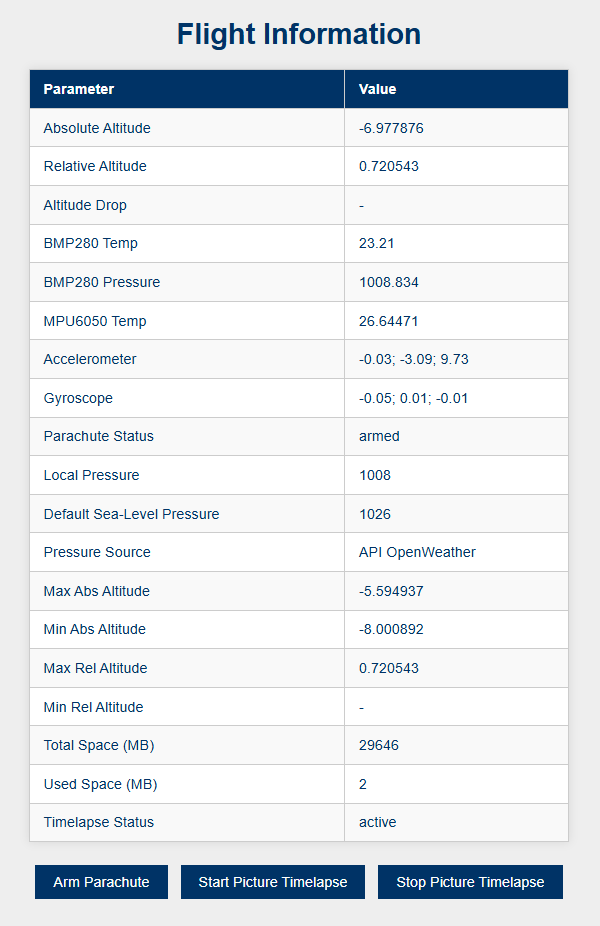

# ESP Controlled Rocket

The ESP Controlled Rocket repository is a comprehensive project that brings together an advanced flight computer system along with detailed 3D printing designs to build and launch a rocket. The project includes embedded firmware for real-time telemetry, sensor integration, parachute deployment, and a complete set of 3D models for printing the rocket parts.

---

## Table of Contents

- [Introduction](#introduction)
- [Flight Computer](#flight-computer)
  - [Features](#features)
  - [Code Overview](#code-overview)
  - [Flight Computer Screenshot](#flight-computer-screenshot)
- [3D Designs](#3d-designs)
  - [Overview of 3D Models](#overview-of-3d-models)
- [Assembly & Build](#assembly--build)
- [Usage](#usage)
- [Rocket Performance Calculations](#rocket-performance-calculations)
- [Contributing](#contributing)

---

## Introduction

The **ESP Controlled Rocket** project combines state-of-the-art embedded firmware with ready-to-print 3D designs to create a complete rocket system. The flight computer manages sensor data, logs flight events, and controls the parachute deployment mechanism while providing real-time telemetry via a web interface. New additions include status indication via RGB LED effects and a manual release function accessible from the web interface.

---

## Flight Computer

### Features

- **Sensor Integration:**  
  - **BMP280 Sensor:** Reads temperature, pressure, and computes altitude.
  - **MPU6050 Sensor:** Provides accelerometer, gyroscope, and sensor temperature data.
- **Real-Time Telemetry:**  
  - A web server with WebSocket support streams live flight data including altitude, temperature, inertial measurements, and parachute status.
- **Parachute Deployment:**  
  - Monitors a corrected altitude drop calculation to trigger the servo-controlled parachute release automatically.
  - Includes a manual release function via the web interface for testing.
- **Enhanced SD Card Logging:**  
  - Logs flight data and key events with accurate timestamps.
- **RGB LED Status Indicators:**  
  - An LED ring provides visual feedback for network connectivity, parachute arming, and release states.
- **WiFi Connectivity & OTA Updates:**  
  - Connects to a predefined network or automatically sets up an access point.
  - Supports remote firmware updates through an HTTP OTA endpoint.
- **Time Synchronization:**  
  - Uses NTP to provide accurate timestamps for logging.

### Code Overview

The flight computer firmware is organized into modules that handle:
- **Sensor Management:** Initialization and continuous reading of the BMP280 and MPU6050 sensors.
- **Data Processing:** Calculation of absolute altitude, relative altitude (with baseline captured at arming), and a corrected altitude drop.
- **Parachute Control:** Both automatic deployment (triggered by an altitude drop exceeding a threshold) and manual release via a web interface.
- **LED Status Indicators:** Control of an RGB LED ring that reflects current system and network status.
- **Communication:** A lightweight web server and WebSocket system that broadcast real-time flight data.
- **Logging:** Timestamped recording of flight events and sensor readings on an SD card.
- **OTA Updates:** Remote firmware update functionality via HTTP OTA and mDNS service.

### Flight Computer Screenshot

---

## 3D Designs - COMMING SOON

The repository includes 3D printing designs for the rocket's structure and components. The models are optimized for easy printing and assembly.

### Overview of 3D Models

- **Rocket Body:**  
  Main structure with compartments for the electronics, payload, and fuel system.
- **Nose Cone & Fins:**  
  Aerodynamic designs to ensure optimal flight performance.
- **Assembly Parts:**  
  Custom brackets and mounting fixtures to integrate the flight computer and sensors securely.

Detailed 3D model files (.STL) and assembly instructions can be found in the [3d_designs](3d_designs) folder.

---

## Assembly & Build

For detailed build instructions, refer to the [Assembly Guide](docs/assembly_guide.md). The guide covers component assembly, wiring, and final system integration including wiring for the new RGB LED indicators and updated parachute control.

---

## Usage

### Setting Up the Flight Computer

1. **WiFi Configuration:**  
   Update the network credentials in the firmware.  
   *Note: The WiFi configuration code has been omitted from this document for security reasons.*  
   If the connection fails, the device will switch to access point mode and indicate its status via LED blinks.

2. **OTA Updates:**  
   Access the OTA update page by navigating to [http://esp32-webupdate.local/update](http://esp32-webupdate.local/update) once the device is connected to WiFi.

3. **Manual Parachute Release:**  
   The web dashboard now includes two buttons:
   - **Arm Parachute:** Arms the parachute and sets the baseline altitude.
   - **Release Parachute:** Immediately triggers the parachute release for testing.

4. **Running the Code:**  
   Compile and upload the code to your ESP32 using the Arduino IDE or PlatformIO.

### Debugging and Logging

The firmware includes various configuration options to control debugging output and logging behavior, such as sensor logs, SD card logging, and LED status indications.

---
## Rocket Performance Calculations

The performance of a water- and air-powered rocket depends on several design and operating parameters. For this project, we assume:

- **Tube Dimensions:**  
  A 6 cm diameter tube (radius = 3 cm) with variable body (tube) lengths.
  
- **Internal Volume (L):**  
  \(V = \pi \times (0.03\,m)^2 \times L_{(m)}\)  
  Converted to liters, for example:  
  For a 100 cm (1 m) tube,  
  \(V \approx 2.83\,L\).

- **Recommended Water Fill:**  
  Approximately 42% of the internal volume is used as water.
  
- **Dry Mass (kg):**  
  Consists of a fixed payload of 0.385 kg plus a tube mass that scales linearly (0.00475 kg per cm).  
  For example, a 100 cm tube:  
  Dry mass ≈ \(0.385 + 0.00475 \times 100 = 0.86\,kg\).
  
- **Total Mass (kg):**  
  Dry mass plus water mass (1 L water ≈ 1 kg).

- **Effective Exit Velocity (\(v_e\)) (m/s):**  
  \(v_e = 17.68 \sqrt{P}\)  
  Where \(P\) is the operating pressure in bar.  
  - 4 bar: \(v_e \approx 35.36\,m/s\)  
  - 6 bar: \(v_e \approx 43.31\,m/s\)  
  - 8 bar: \(v_e \approx 50.00\,m/s\)  
  - 10 bar: \(v_e \approx 55.93\,m/s\)

- **Thrust Duration (\(T\)) (s):**  
  Calculated from the recommended water volume, nozzle area \(A \approx 7.85 \times 10^{-5}\,m^2\), and \(v_e\):
  \[
  T = \frac{\text{Water Volume (m³)}}{A \, v_e}
  \]
  
- **Rocket Δv:**  
  \(\Delta v = v_e \ln\!\left(\frac{m_{\text{total}}}{m_{\text{dry}}}\right)\)

- **Burnout Velocity (\(v_{\rm burn}\)) (m/s):**  
  \(v_{\rm burn} = \Delta v - \tfrac{1}{2}g\,T\) with \(g=9.81\,m/s^2\). This approximates the launch speed at the end of water thrust.
  
- **Estimated Maximum Altitude (\(h\)) (m):**  
  Approximated as:
  \[
  h \approx \frac{v_{\rm burn}^2}{2g} + \frac{1}{2}v_{\rm burn}\,T
  \]
  
- **Flight Duration (s):**  
  Estimated as:
  \[
  \text{Flight Duration} \approx T + 2\left(\frac{v_{\rm burn}}{g}\right)
  \]
  
- **Minimum Altitude (m):**  
  As a pessimistic estimate, 90% of the calculated maximum altitude.

*For a detailed “big matrix” covering various tube lengths (from 50 cm to 300 cm) and operating pressures (4, 6, 8, and 10 bar), please refer to the extended tables in the project documentation.*

---

## Optimal Mix

Based on our simplified models and performance estimates, the following recommendations provide a good balance between thrust, altitude, and practical build considerations:

- **Water Fill:**  
  A water fill of about **42%** of the tube's internal volume offers an optimal compromise. This fraction provides sufficient reaction mass without overly diminishing the available volume for compressed air.

- **Operating Pressure:**  
  While operating at higher pressures (up to 10 bar) can yield higher exit velocities, the gains taper off compared to the increased structural demands. An operating pressure of around **8 bar** is recommended for a strong performance balanced with safety.

- **Tube Length (Body Length):**  
  Although longer tubes provide more volume for water, they also add to the dry mass and may complicate handling and stability. For a 6 cm diameter rocket:
  - **150–200 cm** tube lengths appear to hit the sweet spot.  
  They offer a sufficiently high internal volume (and thus impulse) while keeping the additional mass reasonable.

- **Combined Optimal Configuration:**  
  For a 6 cm diameter rocket, an optimal mix appears to be:
  - **Body Length:** Approximately **150–200 cm**.
  - **Water Fill:** **42%** of the internal volume.
  - **Operating Pressure:** Around **8 bar**.
  
  With these parameters, our model estimates roughly:
  - **Burnout velocity:** ~42–46 m/s.
  - **Maximum Altitude:** ~95–120 m.
  - **Flight Duration:** Around 8–10 s.
  - **Minimum Altitude Estimate:** ~90% of the maximum altitude, offering a safety margin to account for real-world inefficiencies.

These values provide a practical starting point. Experimentation and slight adjustments may be necessary to account for aerodynamic drag, seal imperfections, and material strength considerations.

---

## Contributing

Contributions are welcome! Please follow these guidelines:
- Fork the repository.
- Create a new branch for your feature or bugfix.
- Commit your changes with clear messages.
- Submit a pull request with a detailed description of your changes.
