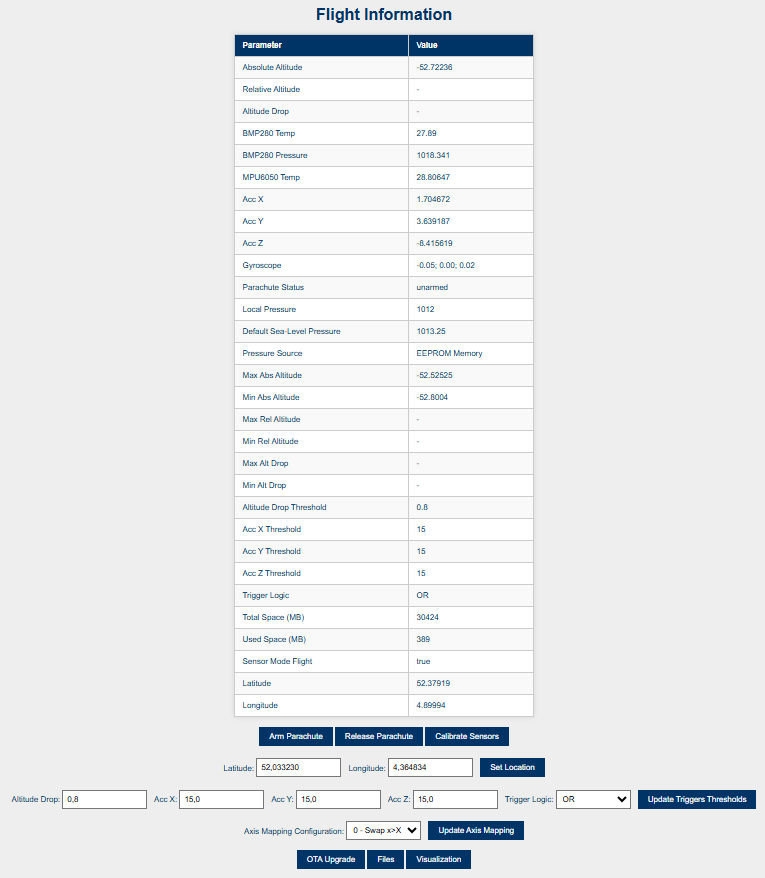
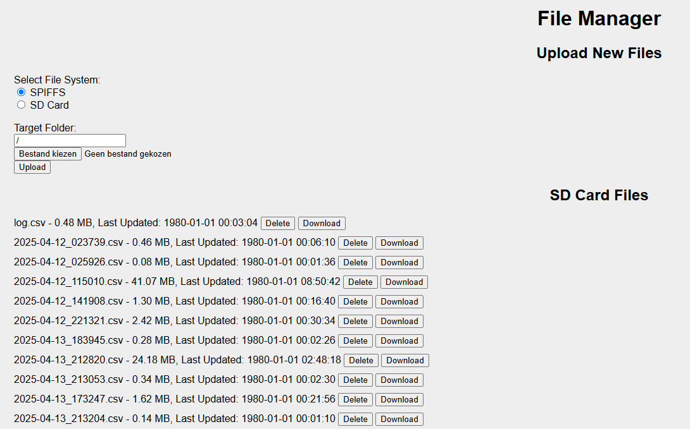
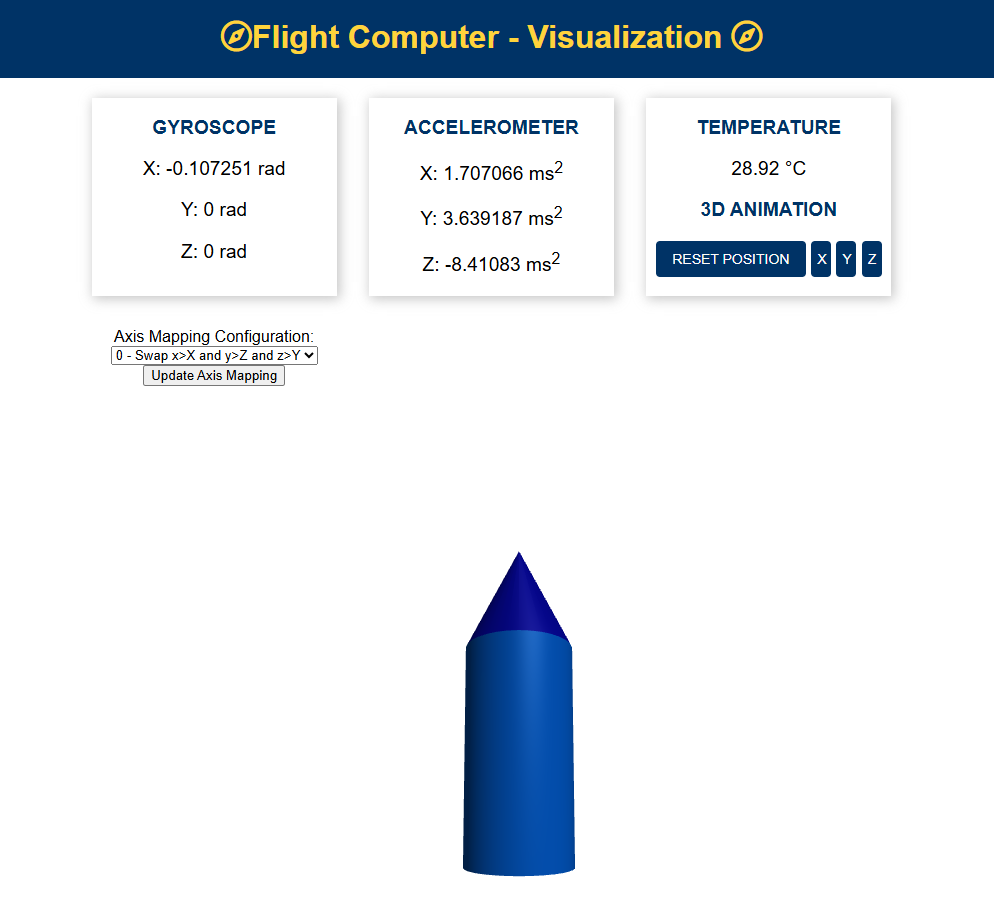

# ESP Controlled Rocket

The ESP Controlled Rocket repository is a comprehensive project that brings together an advanced flight computer system along with detailed 3D printing designs to build and launch a rocket. The project includes embedded firmware for real-time telemetry, sensor integration, parachute deployment, and a complete set of 3D models for printing the rocket parts.

---

## Table of Contents

- [Introduction](#introduction)
- [Flight Computer](#flight-computer)
  - [Features](#features)
  - [Code Overview](#code-overview)
  - [Flight Computer Screenshot](#flight-computer-screenshot)
  - [File Manager Screenshot](#file-manager-screenshot)
  - [Visualization Screenshot](#visualization-screenshot)
- [3D Designs](#3d-designs)
  - [Overview of 3D Models](#overview-of-3d-models)
- [Assembly & Build](#assembly--build)
- [Usage](#usage)
- [Rocket Performance Calculations](#rocket-performance-calculations)
- [Contributing](#contributing)

---

## Introduction

The **ESP Controlled Rocket** project combines state-of-the-art embedded firmware with ready-to-print 3D designs to create a complete rocket system. The flight computer manages sensor data, logs flight events, and controls the parachute deployment mechanism while providing real-time telemetry via a web interface. New additions include status indication via RGB LED effects and a manual release function accessible from the web interface.

---

## Flight Computer

### Features

- **Sensor Integration:**  
  - **BMP280 Sensor:** Reads temperature, pressure, and computes altitude.  
  - **MPU6050 Sensor:** Provides accelerometer, gyroscope, and sensor temperature data.  
- **Real-Time Telemetry:**  
  - A web server with WebSocket support streams live flight data including altitude, temperature, inertial measurements, and parachute status.  
- **Parachute Deployment:**  
  - Monitors a corrected altitude drop calculation to trigger the servo-controlled parachute release automatically.  
  - Includes a manual release function via the web interface for testing.  
- **Enhanced SD Card Logging:**  
  - Logs flight data and key events with accurate timestamps to the on-board SD card.  
- **RGB LED Status Indicators:**  
  - An LED ring provides visual feedback for network connectivity, parachute arming, and release states.  
- **WiFi Connectivity & OTA Updates:**  
  - Connects to a predefined network or automatically sets up an access point if no network is found.  
  - Supports remote firmware updates through an HTTP OTA endpoint (accessible via mDNS).  
- **Time Synchronization:**  
  - Uses NTP to obtain accurate time for timestamping logs and events.  
- **Web-Based File Management:**  
  - Provides a web interface to manage onboard files on both the ESP32’s internal SPIFFS flash and the SD card (supports file upload, download, and deletion).  
- **3D Visualization Support:**  
  - Streams orientation and telemetry data suitable for an optional 3D visualization tool to display the rocket’s attitude in real time (experimental feature, not required for core functionality).  
- **Configurable Axis Orientation:**  
  - The sensor axis alignment can be adjusted at runtime via the web interface to accommodate different board mounting orientations.  
- **Live Location Overrides:**  
  - Allows input of the current latitude and longitude through the web dashboard, which overrides the initially loaded launch coordinates for more accurate altitude calculations and telemetry based on local conditions.

### Code Overview

The flight computer firmware is organized into modules that handle:  
- **Sensor Management**  
- **Data Processing**  
- **Parachute Control**  
- **LED Status Indicators**  
- **Communication**  
- **Web-Based File Management**  
- **3D Visualization Support**  
- **Logging**
- **Configurable Axis Orientation**  
- **Live Location Overrides**  
- **OTA Updates**

### Flight Computer, file manager and visualization dashboards video

### Flight Computer Screenshot

### File Manager Screenshot

### Visualization Screenshot

---

## 3D Designs - COMMING SOON

The repository includes 3D printing designs for the rocket's structure and components. The models are optimized for easy printing and assembly.

### Overview of 3D Models

- **Rocket Body:**  
  Main structure with compartments for the electronics, payload, and fuel system.
- **Nose Cone & Fins:**  
  Aerodynamic designs to ensure optimal flight performance.
- **Assembly Parts:**  
  Custom brackets and mounting fixtures to integrate the flight computer and sensors securely.

Detailed 3D model files (.STL) and assembly instructions can be found in the [3d_designs](3d_designs) folder.

---

## Assembly & Build

For detailed build instructions, refer to the [Assembly Guide](docs/assembly_guide.md). The guide covers component assembly, wiring, and final system integration including wiring for the new RGB LED indicators and updated parachute control.

---

## Usage

### Setting Up the Flight Computer

1. **WiFi Configuration:**  
   Update the network credentials in the firmware.  
   *Note: The WiFi configuration code has been omitted from this document for security reasons.*  
   If the connection fails, the device will switch to access point mode and indicate its status via LED blinks.

2. **OTA Updates:**  
   Access the OTA update page by navigating to [http://esp32-webupdate.local/update](http://esp32-webupdate.local/update) once the device is connected to WiFi.

3. **Manual Parachute Release:**  
   The web dashboard now includes two buttons:
   - **Arm Parachute:** Arms the parachute and sets the baseline altitude.
   - **Release Parachute:** Immediately triggers the parachute release for testing.

4. **Running the Code:**  
   Compile and upload the code to your ESP32 using the Arduino IDE or PlatformIO.

5. **File Management**
  There is a webinterface where all files on SD Card en SPIFF memory can be managed.

### Debugging and Logging

The firmware includes various configuration options to control debugging output and logging behavior, such as sensor logs, SD card logging, and LED status indications.

---
## Rocket Performance Calculations (Various Tube Lengths and Operating Pressures)

Below is a composite table showing key estimated performance parameters for a water– and air–powered rocket with a 6 cm inner diameter tube using a Gardena connector nozzle (~10 mm diameter). The calculations assume an optimal water fill of about 42% of the internal volume and a dry mass defined as a fixed payload of 0.385 kg plus 0.00475 kg per cm of tube length. For each tube length the performance metrics are given for four operating pressures (4, 6, 8, and 10 bar). (All values are approximate.)

*Calculation Notes:*  
- **Internal Volume (L):** \(V = 0.02827 \times \text{Tube Length (cm)}\)  
- **Optimal Water (L):** 42% of \(V\)  
- **Dry Mass (kg):** \(0.385 + 0.00475 \times \text{Tube Length (cm)}\)  
- **Total Mass (kg):** Dry mass + Optimal water (with 1 L water ≈ 1 kg)  
- **Effective Exit Velocity:** \(v_e = 17.68 \sqrt{P}\) (m/s)  
  • At 4 bar: 35.36 m/s; at 6 bar: 43.31 m/s; at 8 bar: 50.00 m/s; at 10 bar: 55.93 m/s  
- **Thrust Duration \(T\) (s):**  
  \(T = \frac{\text{Optimal Water (m³)}}{A \times v_e}\)  
  (Nozzle area \(A \approx 7.85 \times 10^{-5}\,m^2\); note: water volume in m³ = Optimal water [L] ÷ 1000)  
- **Δv (m/s):** \(v_e \times \ln\left(\frac{m_{\rm total}}{m_{\rm dry}}\right)\)  
- **Burnout Speed (m/s):** \(v_{\rm burn} = \Delta v - \tfrac{1}{2}\,g\,T\) (with \(g=9.81\,m/s^2\))  
- **Maximum Altitude (m):** \(h \approx \frac{{v_{\rm burn}}^2}{2g} + \frac{1}{2}\,v_{\rm burn}\,T\)  
- **Flight Duration (s):** \(T + 2\left(\frac{v_{\rm burn}}{g}\right)\)  
- **Impact Speed (m/s):** Assumed approximately equal to \(v_{\rm burn}\)

For each tube length, the four values in square-bracketed columns are listed in the order: **4 bar / 6 bar / 8 bar / 10 bar**.

| Tube Length (cm) | Internal Volume (L) | Optimal Water (L) | Total Mass (kg) | Thrust Time \(T\) (s) [4/6/8/10] | Δv (m/s) [4/6/8/10] | Burnout Speed (m/s) [4/6/8/10] | Maximum Altitude (m) [4/6/8/10] | Flight Duration (s) [4/6/8/10] | Impact Speed (m/s) [4/6/8/10] |
|------------------|---------------------|-------------------|-----------------|---------------------------------|---------------------|-------------------------------|---------------------------------|-------------------------------|------------------------------|
| **75**           | 2.12                | 0.89              | 1.63            | 0.32 / 0.26 / 0.23 / 0.20         | 27.9 / 34.2 / 39.5 / 44.2  | 26.4 / 32.9 / 38.4 / 43.2      | 39.6 / 59.7 / 79.5 / 99.5        | 5.69 / 6.98 / 8.06 / 9.01      | 26.4 / 32.9 / 38.4 / 43.2       |
| **100**          | 2.83                | 1.19              | 2.05            | 0.43 / 0.35 / 0.30 / 0.27         | 30.7 / 37.6 / 43.4 / 48.6  | 28.6 / 35.9 / 41.9 / 47.2      | 47.9 / 65.7 / 96.0 / 120.1       | 6.26 / 7.67 / 8.86 / 9.90      | 28.6 / 35.9 / 41.9 / 47.2       |
| **125**          | 3.53                | 1.48              | 2.46            | 0.53 / 0.44 / 0.38 / 0.34         | 32.5 / 39.9 / 46.0 / 51.5  | 29.9 / 37.7 / 44.2 / 49.8      | 53.6 / 80.8 / 107.6 / 135.0      | 6.64 / 8.13 / 9.38 / 10.50     | 29.9 / 37.7 / 44.2 / 49.8       |
| **150**          | 4.24                | 1.78              | 2.88            | 0.64 / 0.52 / 0.45 / 0.41         | 34.0 / 41.7 / 48.1 / 53.8  | 30.9 / 39.1 / 45.9 / 51.8      | 58.4 / 88.3 / 117.8 / 147.3      | 6.94 / 8.50 / 9.81 / 10.96     | 30.9 / 39.1 / 45.9 / 51.8       |
| **175**          | 4.95                | 2.08              | 3.30            | 0.75 / 0.61 / 0.53 / 0.47         | 35.2 / 43.1 / 49.8 / 55.7  | 31.5 / 40.1 / 47.2 / 53.3      | 62.4 / 94.2 / 125.8 / 157.6      | 7.18 / 8.78 / 10.15 / 11.34    | 31.5 / 40.1 / 47.2 / 53.3       |
| **200**          | 5.65                | 2.37              | 3.71            | 0.85 / 0.70 / 0.60 / 0.54         | 36.0 / 44.0 / 50.9 / 56.9  | 31.8 / 40.6 / 47.9 / 54.3      | 65.1 / 98.1 / 131.4 / 164.7      | 7.34 / 8.97 / 10.37 / 11.61    | 31.8 / 40.6 / 47.9 / 54.3       |

---

## Optimal Mix

Based on the estimates above and practical design trade-offs, an optimal configuration for a 6 cm diameter water rocket appears to be:

| **Parameter**             | **Recommended Value**                                          |
|---------------------------|---------------------------------------------------------------|
| **Tube Diameter**         | 6 cm                                                          |
| **Tube Length**           | 150–200 cm                                                    |
| **Water Fill Fraction**   | ~42% of the internal volume                                   |
| **Operating Pressure**    | ~8 bar                                                        |
| **Nozzle Diameter**       | ~10 mm (Gardena connector)                                    |
| **Expected Burnout Speed**| ~46 m/s (for 150 cm at 8 bar); ~47–54 m/s for 200 cm at 8–10 bar  |
| **Estimated Maximum Altitude** | ~118 m for 150 cm at 8 bar; ~131–165 m for 200 cm at 8–10 bar  |
| **Flight Duration**       | ~9–10 s for 150 cm at 8 bar; ~10–11.6 s for 200 cm at 8–10 bar    |
| **Impact Speed**          | Approximately equal to the burnout speed                      |

*Summary Recommendation:* For a 6 cm diameter rocket, a body length of **150–200 cm**, filled to **42%** of its internal volume with water and operating at around **8 bar** (with a ~10 mm nozzle) is predicted to yield a strong balance between performance (altitude, thrust) and manageable mass and structural demands. Actual performance will depend on factors such as aerodynamic drag, seal quality, and material strength, so practical tests and iterative tuning are advised.

## Contributing

Contributions are welcome! Please follow these guidelines:
- Fork the repository.
- Create a new branch for your feature or bugfix.
- Commit your changes with clear messages.
- Submit a pull request with a detailed description of your changes.
